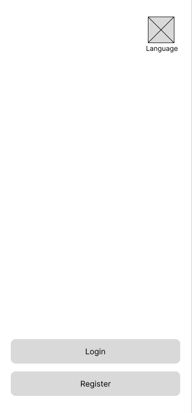
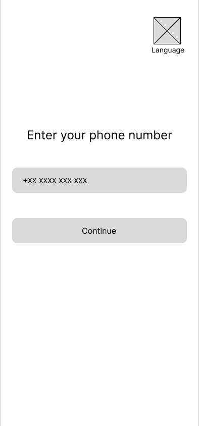
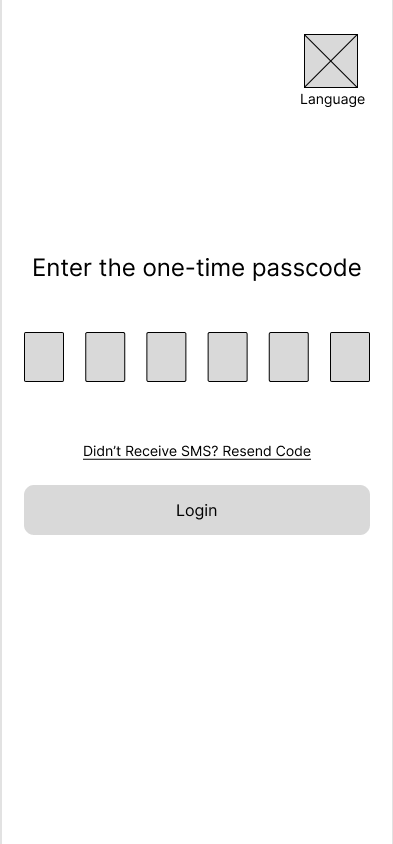
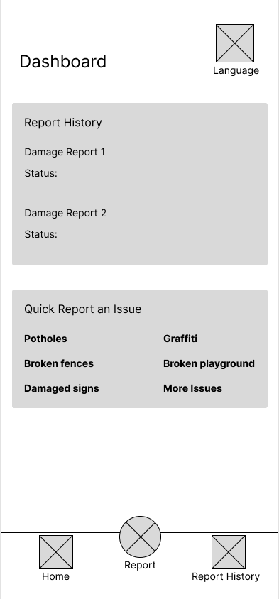
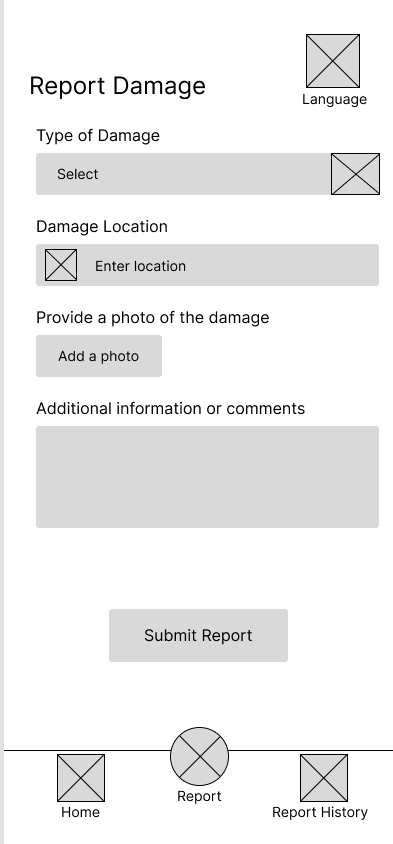
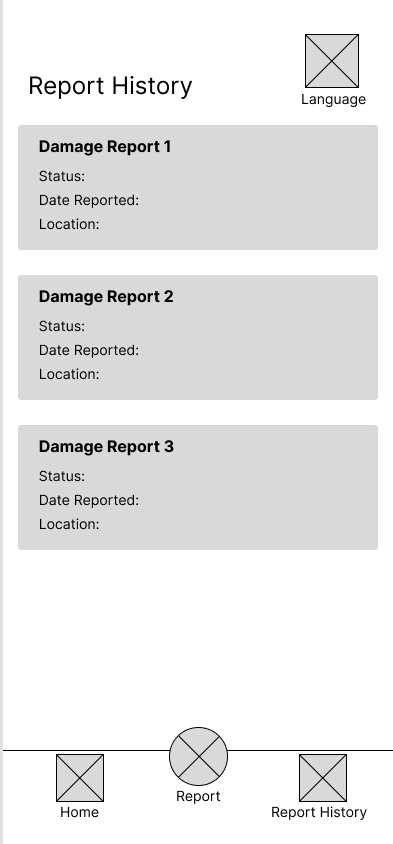

# SpotReport Proposal

"Spot it, Report it"

## App Overview

SpotReport is a reporting app that focuses on providing users the capability to report damage observed in their community on public infrastructure. The damages that can be reported include but are not limited to this list:

- Potholes
- Damaged playgrounds
- Fallen trees
- Broken fences
- Graffiti
- Damaged Signs

Furthermore, as the main aim of the app is to report damages, users will have access to the previous reports they've submitted. This allows them to be notified of the progress of the damage and the response in action.

## Main Features

The SpotReport app highlights numerous features comprising photo incorporation and location input for report submissions, storing report history involving status updates and user authentication with Firebase.

The main objective of the app is reporting damages, which utilises the features to attach a photo and location. This is helpful as descriptions of the damage can sometimes be inadequate. The photo is required as it provides better insight into the extent of the damage and the impact it has on the surrounding area. The implementation of location assists in determining accurately where the damage is.

Report history is a feature that works alongside reporting, which stores reports submitted by the user utilising a status update that notifies users of the ongoing changes in repairing the damaged infrastructure. The reporting history will continue to include reports that have been addressed and completed.

The app will utilise phone number authentication as a method for users to sign up and login to the app. This use of authentication makes it more convenient for users as a passwordless experience is a more practical alternative than requiring users to remember a password. Moreover, it's more advantageous in terms of security as the use of a one-time code sent to the user's phone number can help prevent unauthorised users from accessing an account.

## Target Users

The target audience for this app is aimed to young adults to older adults, but is beneficial to the general public. Damage to public infrastructure affects various groups of people in the community as it can involve inconveniences and safety. Some inconveniences caused by damages can impact daily activities, such as potholes affecting drivers who commute on roads that are unavoidable. Additionally, these potholes can impact the safety of drivers, especially when they get neglected over time they can increase in size.

Users will use the app more frequently when they are outdoors, as they can notice these damaged infrastructures in person. Additionally, the report structure requires a photo attachment and location, thus the need for users to go out to provide this information.

Within this app it has a few elements that might appeal more to users to choose over other competitors, particularly the simplicity of the app design. While it targets both young and older adults, many older adults struggle with using new apps and interfaces. Thus, it can provide an easier transition for them to operate the app. Furthermore, the simple design allows users to efficiently use the app while on the go.

The language element may also appeal to users as it incorporates a language option that includes a diverse range of people who may find another language more comfortable to use. This can be specifically helpful for a number of suburbs with a larger community of a specific ethnicity, especially areas that have older adults who aren't proficient in English.

The phone number authentication might appeal more to younger people. However, as most apps require registering an account, it can generally deter people from using these apps, so utilising a phone number to sign up and login is more convenient for ease of access. In addition, this method of login saves the trouble of remembering passwords.

## App In-Depth

The designed app will have six screens the opening screen, login screen, passcode screen, home screen, reporting screen and report history screen.

### Opening screen

This is the opening screen to which the app opens up. The placement of the language button is in the corner as it makes it visible from the beginning to users of the language option, especially as this button will be consistent across all screens. This will allow easy switching to the preferred language. The rounded rectangle buttons were chosen as they enhance the app's modern appearance, but it was also a practical choice as they span to the sides. The slightly rounded corners make the interface feel less intimidating and more friendly for users and it will be a consistent feature of this app's design. Furthermore, this choice was combined with placing it at the bottom of the screen as it takes account of the thumb zone, making it easier to tap.

### Login screen

From the opening screen, when the login button is tapped it will take the user to the login screen.

Following the simple design, it asks for the user to input their phone number in the text box which will have a shaded phone number example that will disappear when a number is inputted and reappear if the box is cleared. The continue button will take the user to the passcode screen whilst also sending an SMS to the inputted phone number.

### Passcode screen

The passcode screen has six individual boxes for one number of the 6-digit one-time passcode, making it easier to read when inputting. This takes into account for visually impaired users whilst also maintaining a more simple design for users. Likewise, the input boxes match the buttons seen on the previous screens, keeping the design consistent. As observed a resend code link is between the input boxes and login button, in the case a user doesn't receive a code from the previous input of their phone number or the code expired. This link will only resend a code to the user whilst staying on the same page. The login button will transition to the home screen, which is also called the dashboard.

### Home screen

The home screen is an overview of other screens appearing as the starting page. It utilises boxes to group the sections, presenting a clean design. The first box is the report history, which will display the most recent reports the user has made and their status to keep users up to date. The next box is a shortcut to report an issue, as tapping the type of damage will take the user to the report screen with the type of damage automatically filled in. The utilisation of boxes assists in organising the screen, but the minimal information allows the screen to appear less disorganised.

The navigation bar will be on every screen after login and will contain three icons, including home, report and report history. The icon will be in a different colour or highlighted when the user is on the corresponding page, indicating users as to where they are in the app. The report navigation is centred and a circle as it's the main function, making it easier for users to recognise. The placement at the bottom is common in apps as the reachability with one hand is still possible.

### Reporting screen

Pressing the report icon in the navigation bar takes the user to the reporting screen, displaying a simple, uniform design. The element type of damage will utilise a drop-down menu for users to select due to the number of possible types. In damage location, the user will type the address, and it will provide location options similar to map apps. Photo attachment is a button that will ask for access to the user's photos app to provide the required photo or photos of the infrastructure damage. Additional information will be optional but useful for users to fill in, such as personal observations that the photo couldn't capture, especially if it involves motion or movement. The submission button is narrower compared to the elements of this report screen as it assists in differentiating sections of the screen, further seen in the larger spacing between the text box for additional information and the button.

### Report History screen

The right icon in the navigation bar will take the user to the report history screen. Following the consistent design of the wide boxes, it groups the individual reports providing more information of the previous reports created. This screen will be scrollable, allowing users to view all their previous reports, including completed reports.

## MVP App Implementation

For the minimum viable product (MVP), the core functionalities from the design that will be the goal to implement are the reporting feature, which will include all existing elements, storing reports for report history, basic navigation bar and phone number authentication. In regards to the screens that will be the minimum to include are the login screen, passcode screen, reporting screen and report history screen. These are necessary to exhibit a viable app's functionality. Thus the opening screen and dashboard will be left out in the MVP as they are supporting screens targeted towards creating a seamless experience for users. Design elements that will be maintained are the navigation bar and language icon on every screen. However, the navigation bar for the home dashboard will be a placeholder, whilst report and report history will function and transition to other screens.
