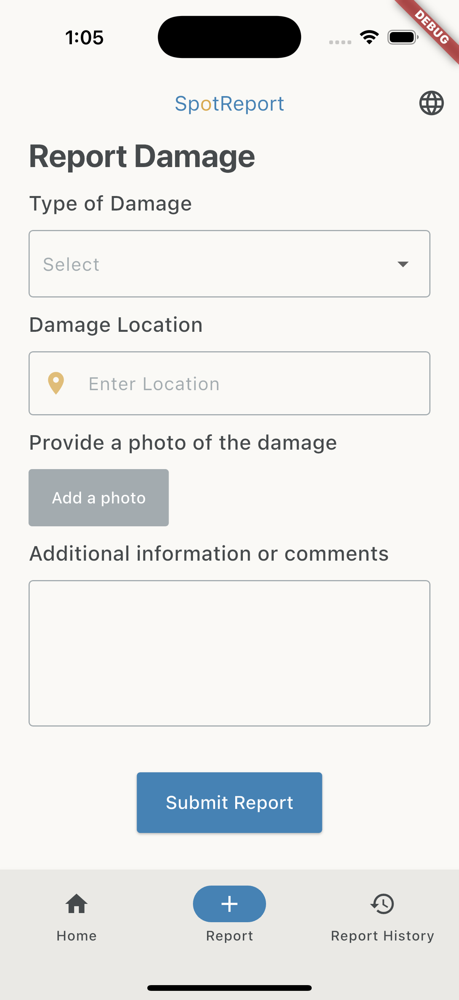

# SpotReport

SpotReport is a reporting app that focuses on providing users the capability to report damage observed in their community on public infrastructure. The damages that can be reported include but are not limited to this list:

- Potholes
- Damaged playgrounds
- Fallen trees
- Broken fences
- Graffiti
- Damaged Signs

The main aim of the app is to report damages, users will have access to the previous reports they've submitted. This allows them to be notified of the progress of the damage and the response in action.

The app helps raise awareness of public infrastracture damages, targeting young to older adults. It benefits the community by highlighting issues that can impact daily activities and present safety risks.



## Core Features

- Submit damage reports with:
  - Category of the damage
  - Location details using the `geolocator` and `geocoding` package
  - Descriptions
  - Upload photos using the `image_picker` package
- View history of user's previously submitted reports
- User Authentication via Firebase Authentication
- Data storage via Firebase Firestore

## Tech Stack

- **Language:** Dart
- **Framework:** Flutter
- **Databases:** Firebase Firestore
- **Platforms/Services:** Firebase (Authentication & Firestore)
- **Packages:**
  - `geolocator`
  - `geocoding`
  - `image_picker`
  - `firebase_auth`
  - `cloud_firestore`

## Devices Developed For and Tested

- iOS Xcode simulator
- Android Emulator
- Chrome Web

## Installation & Run Locally

```bash
# Clone the repository
git clone https://github.com/NJ1114/SpotReport.git

# Navigate to the project directory
cd SpotReport

# Install dependencies
flutter pub get

# Run in simulator, emulator or browser
flutter run
```

## Future Development

- **Social Interaction:** Add a feature to allow users to see other reports from other users in the current viscinity of their device.
- **Improving photo uplod:** Allow the selected image to be saved instead of a placeholder.
